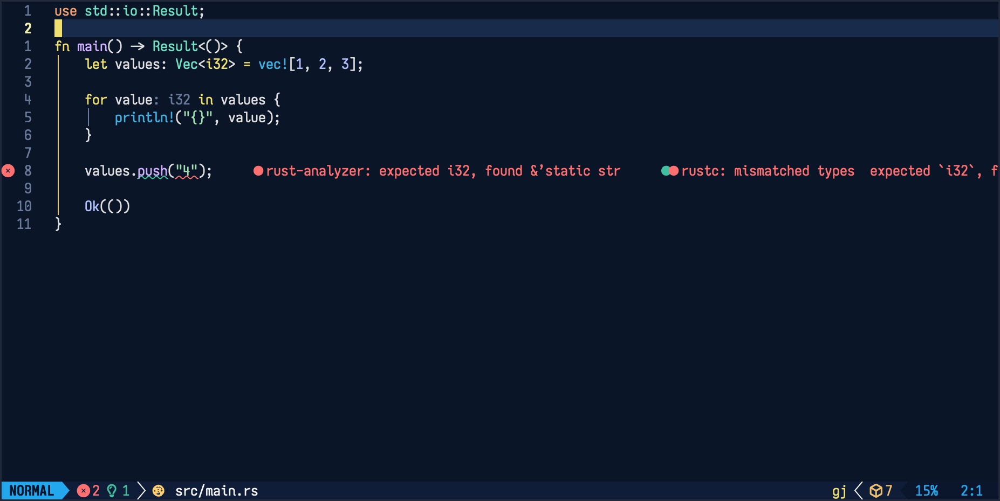
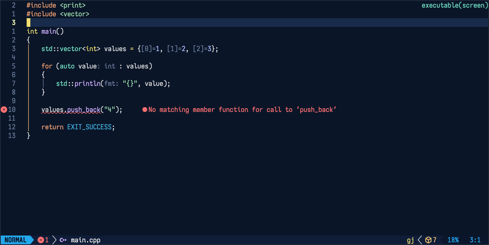
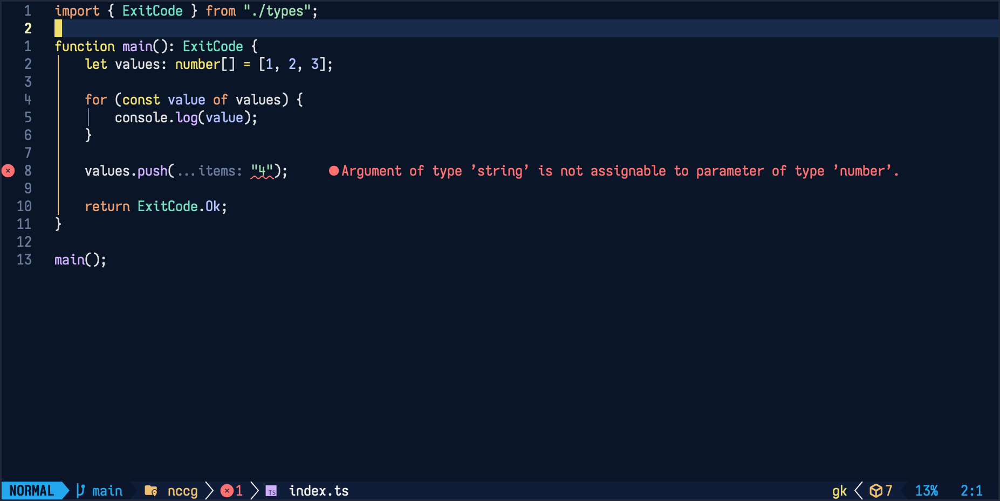
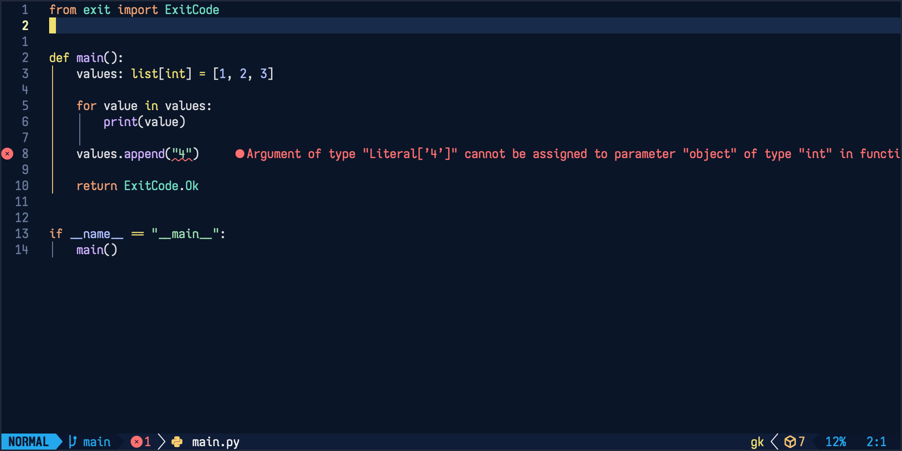
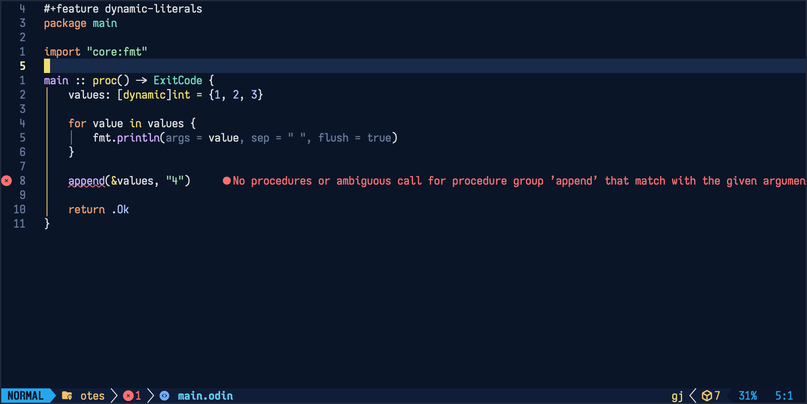

# Turbo-Plus.nvim

A modern, softer take on Turbo C++ colorscheme for Neovim.

<details>
  <summary> Gallery (Click to expand) </summary>

##### Rust


##### CPP


##### TypeScript


##### Python


##### Odin

  
</details>

## Install

### lazy.nvim

```lua
{
  "rivethorn/turbo-plus.nvim",
  lazy = false,
  priority = 1000,
  config = function()
    vim.cmd.colorscheme("turbo-plus")
  end,
}
```

### Lazyvim

```lua
return {
    {
        "rivethorn/turbo-plus.nvim",
        lazy = false,
    },

    {
        "LazyVim/LazyVim",
        opts = {
            colorscheme = "turbo-plus",
        },
    },
}
```

### packer.nvim

```lua
use "rivethorn/turbo-plus.nvim"
```

Then `:colorscheme turbo-plus`.

## License

MIT — see `LICENSE`.
